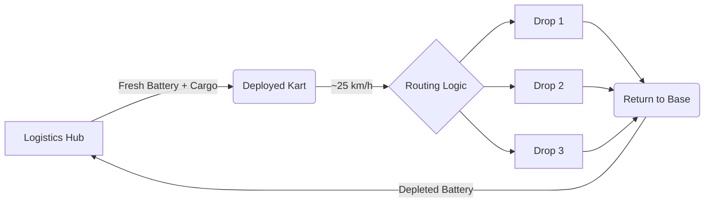
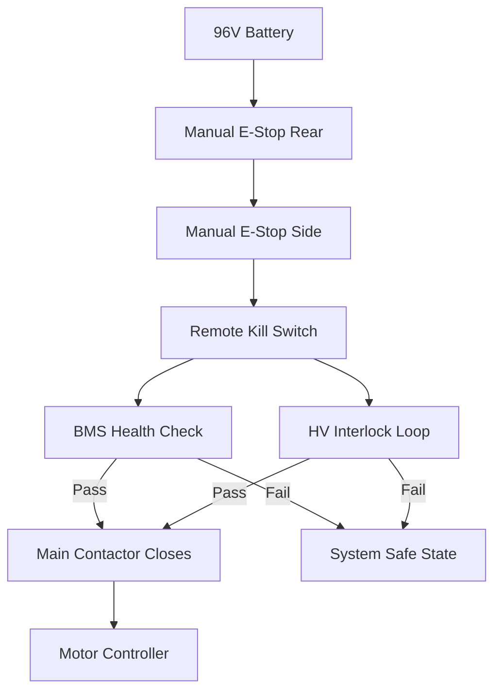

# FREYA: High-Performance Autonomous Logistics Platform

**Figure 1**  
*The “Sprint-Delivery” Variant*  
Aerodynamic, enclosed cargo pod built on a professional racing chassis (OTK / LN Four).

---

## 1. Executive Summary: The **Goldilocks Thesis**

### The Problem

Current last-mile delivery systems are structurally mismatched to efficiency, safety, and urban scalability.

**Vans (Tesla / Rivian-class EVs)**  
Moving a ~2,000 kg vehicle to deliver a ~5 kg payload is thermodynamically inefficient, increases pedestrian risk, and contributes to congestion. Even electric vans typically consume **~200–300 Wh per mile** in urban duty cycles.

**Existing Ground Delivery Robots (Starship, Serve, Kiwibot, Refraction AI)**  
Sidewalk-class robots are constrained by low speeds (**~6–10 km/h**), modest payloads (**~5–50 kg**), and limited operational envelopes.

**Aerial Drones**  
Drones face strict airspace regulation, noise pollution, weather sensitivity, and low practical payload limits (**<2–5 kg**).

### The Solution

An autonomous ground agent engineered for sidewalks, bike lanes, and low-speed urban corridors.

**Form Factor**  
*Knee-height electric kart* capable of sidewalk or bike-lane operation where permitted.

**Hardware DNA**  
*Professional racing-grade chassis* adapted for autonomous operation.

**Philosophy: Sprint Delivery**  
High-performance hardware optimized for short runs using **hot-swappable batteries**.

---

## 2. Business Case & Unit Economics

### 2.1 Unit Economics Comparison

| Metric | Human Courier (Van / Car) | Project Velocity (Swarm Model) | Impact |
|------|--------------------------|-------------------------------|--------|
| **Asset Cost (CapEx)** | ~$45,000 | ~$3,500–$5,000 | ~90% lower |
| **Labor Cost** | ~$20/hr | ~$0.40/hr | ~98% reduction |
| **Energy Use** | ~200–300 Wh/mi | ~35–60 Wh/mi | 4–7× gain |
| **Idle Cost** | High | Zero | Higher margin |
| **Liability Risk** | High | Low | Lower insurance |

### 2.2 Swarm Operational Flow

---

## 3. Hardware Architecture

### 3.1 Chassis & Propulsion

**Base Platform:** OTK Group LN Four racing chassis  
**Motor:** 96V PMAC  
**Output:** ~20 kW continuous / ~35 kW peak  
**Drive:** Direct rear axle, single ratio  
**Brakes:** Hydraulic, drive-by-wire

### 3.2 Sprint Battery Strategy

- **96 V nominal**
- **~50 Ah (~4.8 kWh)**
- **Chemistry:** NMC or LiFePO₄
- **Hot-swappable** via high-current quick disconnects

### 3.3 Payload: The **Smart Drawer**

- Sliding rear drawer
- Multiple lockable compartments
- QR-based customer unlock

---

## 4. Systems & Safety Topology

### 4.1 High-Voltage Safety Loop

### 4.2 Compute & Sensor Stack

- NVIDIA Jetson-class compute
- 4× cameras (360°)
- Solid-state LiDAR
- GNSS/RTK + IMU
- 5G/LTE

---

## 5. Software Roadmap

**Phase 1:** Drive-by-wire teleoperation  
**Phase 2:** Shadow mode data collection  
**Phase 3:** Geofenced autonomy using ROS 2 + Isaac Sim

---

## 6. Manufacturing Workflow

1. De-ICE chassis
2. Install CNC mounts
3. Integrate motor and drivetrain
4. Route HV/LV wiring
5. Install safety interlocks
6. Mount Smart Drawer
7. Install aerodynamic shell
8. Commission system

---

## 7. Logistics & Balance of System

- Central hub for charging and swaps
- <2 minute turnaround target
- Regulatory strategy: PDD classification where available

---

## Feasibility Summary

Project Velocity aligns with demonstrated autonomous delivery robot efficiency while pushing performance beyond current sidewalk-class platforms. Key risks are regulatory approval at higher speeds, perception robustness, and jurisdictional variation.
